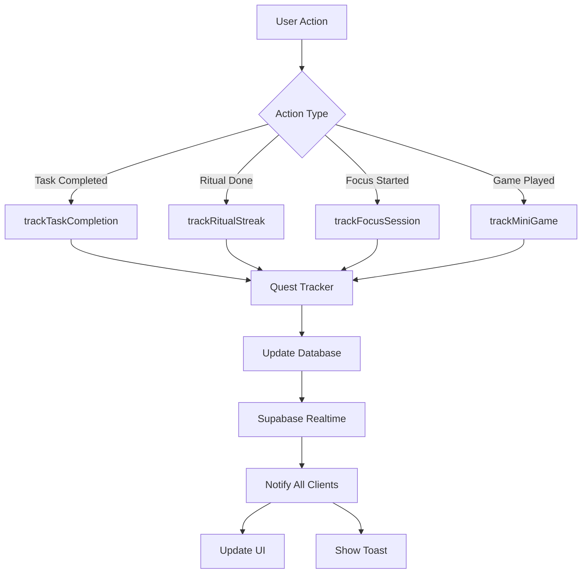

# Quest Progress Tracking System

## Overview
The quest progress tracking system automatically monitors user actions and updates weekly quest progress in real-time without manual intervention.

## Architecture

### Core Components

1. **Quest Tracker Singleton (`src/lib/questTracker.ts`)**
   - Centralized quest progress management
   - Handles all quest type updates
   - Prevents duplicate progress increments

2. **Real-time Notifications (`src/features/quests/QuestProgressNotification.tsx`)**
   - Listens to database changes via Supabase Realtime
   - Shows toast notifications on quest completion and milestones
   - Automatically refreshes UI

3. **Quest Tracking Hook (`src/hooks/useQuestTracking.ts`)**
   - React hook for component-level quest tracking
   - Provides tracking functions for all quest types
   - Manages real-time subscriptions

## Tracked Quest Types

### 1. Task Completion (`complete_tasks`)
**Tracked in:** `src/hooks/useTasks.ts`
**Trigger:** When a task is marked as completed
**Implementation:**
```typescript
questTracker.trackTaskCompletion();
questTracker.checkProjectCompletion();
```

### 2. Ritual Streaks (`ritual_streak`)
**Tracked in:** `src/App.tsx`
**Trigger:** When morning or evening ritual is completed
**Implementation:**
```typescript
questTracker.trackRitualStreak();
```
**Note:** Updates based on user's current reflection_streak in profile

### 3. Focus Sessions (`focus_sessions`)
**Tracked in:** `src/features/focus/FocusMode.tsx`
**Trigger:** When a focus session starts
**Implementation:**
```typescript
questTracker.trackFocusSession();
```

### 4. Mini-Games (`mini_games`)
**Tracked in:** All mini-game components
- `src/features/minigames/BounceGame.tsx`
- `src/features/minigames/MemoryMatch.tsx`
- `src/features/minigames/PeekABoo.tsx`

**Trigger:** When mini-game component mounts
**Implementation:**
```typescript
useEffect(() => {
  questTracker.trackMiniGame();
}, []);
```

### 5. Project Completion (`complete_project`)
**Tracked in:** `src/hooks/useTasks.ts`
**Trigger:** After any task completion
**Logic:** Checks if any category has ≥5 tasks and all are completed
**Implementation:**
```typescript
questTracker.checkProjectCompletion();
```

## Real-time Updates

### Database Level
- Quest progress updates trigger Postgres change events
- Supabase Realtime broadcasts changes to subscribed clients

### UI Level
- `QuestProgressNotification` component subscribes to updates
- Shows toast notifications for:
  - Quest completion (100%)
  - Halfway milestone (50%)
- Auto-invalidates React Query cache for instant UI refresh

### Integration Points

1. **Main App (`src/pages/Index.tsx`)**
   ```typescript
   <QuestProgressNotification />
   ```

2. **Quest Page (`src/pages/Quests.tsx`)**
   ```typescript
   useQuestTracking(); // Initializes real-time tracking
   ```

## How It Works

### Automatic Tracking Flow


### Progress Update Logic

1. **Increment Quests**: Most quests increment by 1 each time
   ```typescript
   newValue = currentValue + 1
   ```

2. **Direct Value Quests**: Some quests set specific values
   ```typescript
   // Ritual streak uses profile value
   newValue = profile.reflection_streak
   ```

3. **Completion Check**
   ```typescript
   completed = newValue >= targetValue
   ```

4. **No Decrease**: Progress never decreases
   ```typescript
   if (newValue <= quest.current_value) return;
   ```

## Adding New Quest Types

To add a new quest type:

1. Add quest template to `supabase/functions/generate-weekly-quests/index.ts`:
   ```typescript
   {
     type: 'new_quest_type',
     title: 'Quest Title',
     description: 'Quest Description',
     targetValue: 5,
     rewardXp: 100,
     rewardAffection: 5,
   }
   ```

2. Add tracking method to `src/lib/questTracker.ts`:
   ```typescript
   async trackNewQuestType() {
     await this.updateProgress([{ questType: 'new_quest_type' }]);
   }
   ```

3. Call tracker where action occurs:
   ```typescript
   questTracker.trackNewQuestType();
   ```

## Performance Considerations

- **Debouncing**: Quest updates are batched to prevent excessive database calls
- **Caching**: React Query caches quest data, only refetches on changes
- **Selective Updates**: Only updates quests matching the action type
- **Real-time Subscriptions**: Single channel per page, cleaned up on unmount

## Debugging

### Check Quest Progress
```typescript
// In browser console
const { data } = await supabase
  .from('weekly_quests')
  .select('*')
  .eq('week_start', 'YYYY-MM-DD');
console.log(data);
```

### Monitor Real-time Events
```typescript
// Enable logging in QuestProgressNotification
console.log('Quest updated:', payload);
```

### Verify Tracking Calls
```typescript
// Add logging to questTracker
console.log('Tracking:', questType, newValue);
```

## Future Enhancements

- [ ] Add quest history/analytics
- [ ] Implement quest chains (complete A to unlock B)
- [ ] Add weekly quest leaderboards
- [ ] Create custom user-defined quests
- [ ] Add quest difficulty tiers
- [ ] Implement bonus objectives within quests
